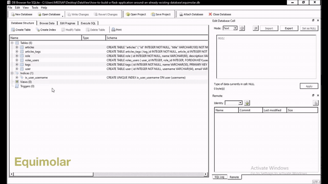

# How to build a flask application around an already existing database

There are several tutorials on how to build a Flask app from ground-up. What if we already have a database from another application and we are only interested in connecting to it to utilize its data? As in this [stackoverflow thread](https://stackoverflow.com/questions/17652937/how-to-build-a-flask-application-around-an-already-existing-database) and we shall be adapting [this answer](https://stackoverflow.com/a/19064993). In such a case, we need not worry about recreating the table columns what we just have to declare the needed table(s) names(s) and we are good to go.

For the sake of this example, I have come up with a small and simplified version of [equimolar.com](https://equimolar.com) database shown in the database viewer below.

